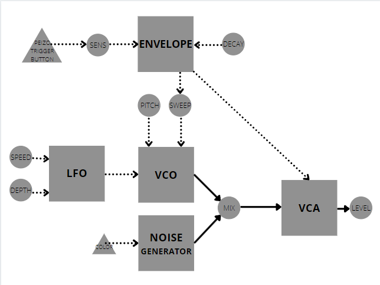
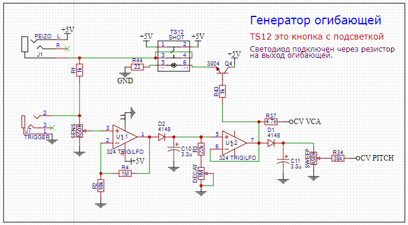
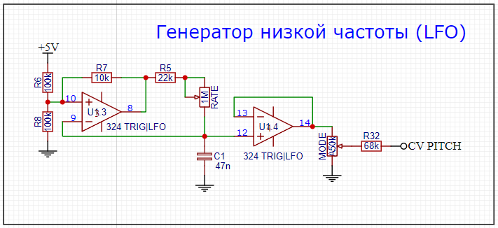
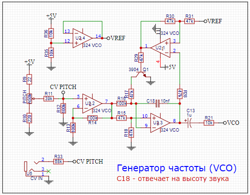
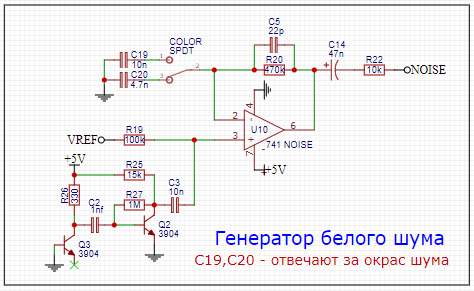
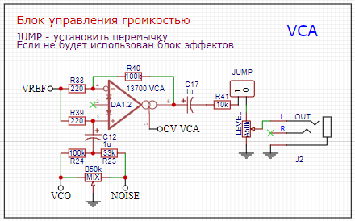
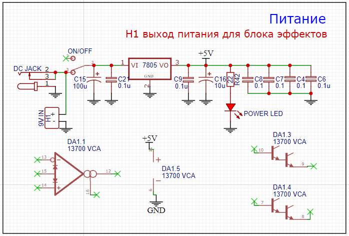

### Драм-синтезатор состоит из 4-х функциональных блоков:
+ VCO — Генератор звуковой частоты
+ LFO — Генератор низкой частоты
+ ENVELOPE — Генератор огибающей
+ Noise Gen — Генератор белого шума
+ VCA — Усилитель управляемый напряжением

 
На блок-схеме изобразил как они между собой связаны с учетом ручек управления.

Начнем с входного каскада, он же является и генератором огибающей. 
После подачи сигнала на вход, заряжается конденсатор C10, ручка DECAY отвечает за его разрядку, чем выше значение, тем медленнее он будет разряжаться, соответственно и затухание будет более долгим. 
Его емкостью можно изменить продолжительность затухания.

TS12 это просто тактовая кнопка с подсветкой, она подключена на выходе генератора через транзистор и отображает разряженность конденсатора, а соответственно можно визуально увидеть какое значение DECAY выставленно. 
 

Генератор низкой частоты (LFO) выдает треугольный сигнал и отвечает только за модуляцию в высоте звука, очень просто устроен и ничего больше писать здесь не буду. 
 

VCO — Простой генератор синусоиды на трех ОУ, 4 ОУ используется как повторитель напряжения средней точки, для более стабильной работы. 
Конденсатор С18 отвечает за высоту звука, соответственно можно сделать его ниже, увеличив его емкость или выше, уменьшив ее.
 

Генератор шума построен на двух транзисторах, база одного из которых не подключена ни к чему, для получения различных помех, после чего сигнал усилен ОУ. 
 

VCA — Усилитель управляемый напряжением, отвечает за громкость, микс с шумом и в общем то ничего больше. 
Схема типового успользования подобной микросхемы, в оригинале используется CA3080, производство которых давно завершено. Вместо нее использован современный аналог LM13700. 
Это абсолютно такой уже усилитель, только на два канала и добавлен буффер сигнала, но это впрочем не используется здесь.
 

Питание здесь реализовано от 5в, честно сказать не знаю, почему выбрано именно такое напряжение, данная схема вполне может работать и от большего, но менять здесь ничего не стал, чтоб сохранить максимум аутентичности.

