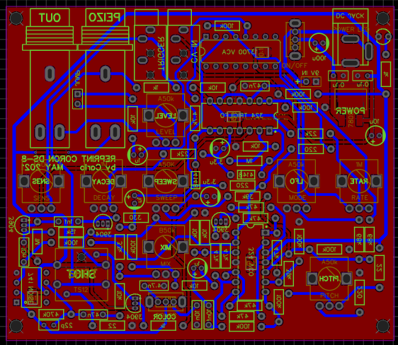

# CORON DS-8 /w LP + DELAY with Mod

Это копия аналогового синтезатора ударных CORON DS-8 
Кроме стандартных фунций прибор получил Low Pass фильтр и дилей с модуляцией.

Есть возможность расширения функционала за счет дополнительных модулей с другими эффектами

##### Модули с другими эффектами буду добавлять по мере возможностей 

### [Как заказать плату](https://github.com/EugeneCarlo/OVERLY-LOWERLY-Guitar-Pedal/blob/main/How%20to%20get%20PCB/README.md)

### [Как работает](https://github.com/EugeneCarlo/coron-ds8-super-huevo-edition/blob/main/How%20it%20works/README.md)

### [Как собрать](https://github.com/EugeneCarlo/coron-ds8-super-huevo-edition/blob/main/How%20to%20assemble/README.md)

### [Список комлектующих](https://github.com/EugeneCarlo/coron-ds8-super-huevo-edition/tree/main/BOM)

#### [GERBER - Верхняя панель](https://github.com/EugeneCarlo/coron-ds8-super-huevo-edition/raw/main/PCB/Gerber_PANEL.zip)
#### [GERBER - Основная плата](https://github.com/EugeneCarlo/coron-ds8-super-huevo-edition/raw/main/PCB/Gerber_MOTHER%20MK3%20copy.zip)
#### [GERBER - Плата эффектов](https://github.com/EugeneCarlo/coron-ds8-super-huevo-edition/raw/main/PCB/Gerber_EFX.zip)
#### [GERBER - Нижняя панель](https://github.com/EugeneCarlo/coron-ds8-super-huevo-edition/raw/main/PCB/Gerber_DNO.zip)

 
 

## Управление возможно:
+ С кнопки (подсветка кнопки отображает значение ручки decay)
+ С пьезо-датчика (выведена на гнездо для подключения внешнего датчика)
+ CV/GATE (для управления с контроллеров и других приборов)

## Управление:
+ LEVEL - Громкость
+ SENS - Чувствительность пьезодатчика
+ DECAY - Время затухания
+ SWEEP - Плавное изменение высоты (зависимость от ручки DECAY)
+ NOISE - Добавления белого шума
+ COLOR - Характер шума (тумблер)
+ LFO - Глубина вибрато
+ RATE - Скорость вибрато
+ PITCH - Высота звука
---------
+ CUT-OFF - Частота среза фильтра
+ RESONANCE - Увеличение частот среза
---------
+ MIX DELAY - Уровень громкости дилея
+ FEEDBACK - Максимально количество повторов
+ TIME - Скорость дилея
+ DEPTH - Глубина модуляции
+ SPEED - Скорость модуляции
## Подключение:
+ CV IN - Управление напряжением высотой звука
+ TRIGGER - Запуск звука
+ PIEZA - Подключение пьезо-датчика
+ OUT - Выход синтезатора

##### Ссылки на необходимые детали с алика:

#### [Потенциометры](https://aliexpress.ru/item/1871188517.html)
#### [Колесики](https://aliexpress.ru/item/4000702166610.html)
#### [Тумблера](https://aliexpress.ru/item/32723119383.html)
#### [Кнопки](https://aliexpress.ru/item/4000224636043.html)
#### [Гнезда 6.3 (ЧиД)](https://www.chipdip.ru/product/st-008s-05)
#### [Гнезда 3.5 (ЧиД)](https://www.chipdip.ru/product/st-215n-04)

### Пример комплекта плат, которые должны получиться:

В новой версии используется LM13700 вместо CA3080 в связи с малой доступность последней
 
Так же для удобства добавлены надписи на нижней плате, указывающие за какие параметры отвечают колесики 

 

Прибор компактный (10х8см)

Питание от "гитарного" блока питания 9в и может по желанию дополнен отсеком для батарейки.

Для использования синтезатора без эффектов, достаточно установить джампер на контакты с отметкой JUMP
